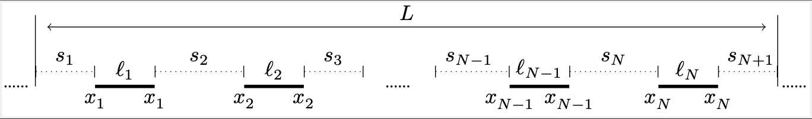

# Complex Band Structure

In this computational notebook, we consider the quasiperiodic Helmholtz scattering problem:

  

## One Dimensional Resonator Chains:

  

## Bandfunctions:

### Subwavelength Regime

#### Quasiperiodic Capacitance
In the subwavelength regime the complex quasiperiodic capacitance matrix allows us to find explicit formulas for the band and gap functions.
- `OneD_Monomer_Band.m`

  

- `OneD_Dimer_Band.m`
 
  

### General Regime

#### Transfer/Propagator Matrix:
In one-dimensional systems, the Helmholtz scattering problem reduces to an ODE, meaning that its solution can be propagated from initial values. The propagation of an eigenmode over one unit cell is modeled via the transfer matrix.

- `OneD_General_Band.m`
  
  

## Localisation Effects:

### Exponentially localised Interface modes

The defect supports an eigenfrequency in the band gap of the dimer. The compelex quasimomentum associated to this gap frequency accurately preicts the decay length of the defect eigenmode.

- `OneD_InterfaceModes.m`
 
  

 
  

### Non-Hermitian Skinn effect
In some non-Hermitian systems such as in the skin effect, the energy leakage can be factored out and the spectral problem can be reformulated as a gap problem, where the complex quasimomentum accurately predicts the decay lenghth of the eigenmodes.

- `OneD_SkinEffect.m`
- `OneD_RandomGauge.m`
- `OneD_AlgebraicSkin.m`

  

## Two Dimensional Resonator Chains:

### Setup:
We consider a two-dimensional infinite screen of circular resonators.

  

### Multipole Expansion:
In the case of spherical resonators, the solutions to the scattering problem are expressed in spherical harmonics. By choosing a finite-order multipole expansion, the single-layer potential admits a matrix representation [Section A.2, 1].

### Quasiperiodic Capacitance Matrix:
The Capacitance Matrix is a computationally efficient way to reduce the scattering problem to a finite eigenvalue problem. The eigenvalues of the quasiperiodic capacitance matrix then parameterise the band functions of the spectral problem [Theorem 3.8, 1].

## Singularities in the Band Structure

At certain quasiperiodicities the single layer potential fails to be invertible, leading to singularities in the bandfunctions.
- `TwoD_CapacitanceSurface.m`

  

-`TwoD_SLP_KernelSurface.m`

  

We compute the field solution poised at a parameter valued point such that the single layer potential fails to e invertible.

-`TwoD_FieldSol.m`

  

## Defect modes

A defected resonator lattice supports eigenfrequencies inside the bandgap. The localisation strength of the defect eigenmode is accurately predicted by the complex band structure.
- `TwoD_ComplexBands.m`

  

## Runtime and Convergence

We consuct a runtime and convergence analysis, with respect to the truncation size of the lattice sum defining the single layer potential.
- `TwoD_RuntimeSLP.m`
  
  

- `TwoD_ConvergenceSLP.m`
  
  

  

## References:
When using the code in the repository, please cite the following two references:

[1] De Bruijn Y and Hiltunen E O, *Complex Band Structure for Subwavelength Evanescent Waves*. Studies in Applied Mathematics (https://doi.org/10.48550/arXiv.2409.14537).

[2] De Bruijn Y and Hiltunen E O, *Complex Band Structure for non-Hermitian spectral problems*.
