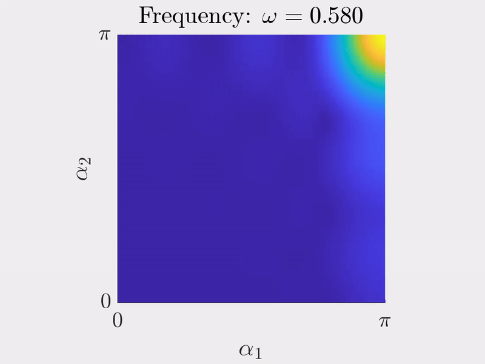

# Complex Band Structure
Authors: E. O. HILTUNEN and Y. DE BRUIJN

Date: 04.02.2025

------------------------------------------------------------------------------------------------------------------

In this computational notebook, we provide the MATLAB code for the computations in [1, 2]. We focus on the quasiperiodic Helmholtz scattering problem:

  

# I. One Dimensional Resonator Chains:
### Setup:

We consider infinitely repeated unit cells, each of length L and containing N resonators.

  

## I.1 Bandfunctions:

### Subwavelength Regime
In a setting where $0 < \delta \ll 1$, we seek non-trivial eigenfrequencies for the Helmholtz scattering problem such that $\omega(\delta)\to 0$, as $\delta \to 0$.

#### Quasiperiodic Capacitance
In the subwavelength regime, the complex quasiperiodic capacitance matrix enables us to derive explicit formulas for the band and gap functions.
- `OneD_Monomer_Band.m`

  

- `OneD_Dimer_Band.m`
 
  

### General Regime
In this setting, we consider an arbitrary  contrast $\delta \in [0,1] $.

#### Transfer/Propagator Matrix:
In one-dimensional systems, the Helmholtz scattering problem reduces to an ODE, allowing its solution to be propagated from initial values. The propagation of an eigenmode over one unit cell is modeled using the transfer matrix, which enables the determination of band functions.

- `OneD_General_Band.m`
  
  

## I.2 Localisation Effects:

### Exponentially localised Interface modes

The geometric defect supports an eigenfrequency within the band gap of the dimer. The complex quasimomentum associated with this gap frequency accurately predicts the decay length of the defect eigenmode.

- `OneD_InterfaceModes.m`
 
  

 
  

### Non-Hermitian Skinn effect
In certain non-Hermitian systems, such as those exhibiting the skin effect, energy leakage can be factored out, allowing the spectral problem to be reformulated as a gap problem. In this framework, the complex quasimomentum accurately predicts the decay length of the eigenmodes.

- `OneD_SkinEffect.m`
- `OneD_RandomGauge.m`
- `OneD_AlgebraicSkin.m`

  

# II. Two Dimensional Resonator Chains:

### Setup:
We consider a two-dimensional infinite screen of circular resonators.

  

### Multipole Expansion:
In the case of spherical resonators, the solutions to the scattering problem are expressed in spherical harmonics. By choosing a finite-order multipole expansion, the single-layer potential admits a matrix representation [Section A.2, 1].

### Quasiperiodic Capacitance Matrix:
The Capacitance Matrix is a computationally efficient way to reduce the scattering problem to a finite eigenvalue problem. The eigenvalues of the quasiperiodic capacitance matrix then parameterise the band functions of the spectral problem [Theorem 3.8, 1].

## II.1 Singularities in the Band Structure

At certain quasiperiodicities, the single-layer potential becomes non-invertible, resulting in singularities in the band functions.
- `TwoD_CapacitanceSurface.m`

  

- `TwoD_SLP_KernelSurface.m`

  

We compute the field solution poised at a parameter valued point such that the single layer potential fails to be invertible. We observe that the field solution is zero on the resonators. The resonator edges are highlined in red.

- `TwoD_FieldSol.m`

  

## II.3 Defect modes

A defected resonator lattice supports eigenfrequencies within the band gap. The localization strength of the defect eigenmode (blue x) is accurately predicted by the complex band structure (red lines).
- `TwoD_ComplexBands.m`

  

## II.4 Phase change within the Band Gap

This animation illustrates the phase shift $\alpha$ for frequencies $\omega$ within the band gap. This phase shift corresponds to the hopping between gap bands in Section II.3.

- `TwoD_DefectMaster.m`

 

## II.5 Runtime and Convergence

We conduct a runtime and convergence analysis with respect to the truncation size of the lattice sum defining the single-layer potential. The quasiperiodic capacitance matrix characterises the subavelength resonant frequencies up to $\mathcal{O}(\delta)$, where typicall we choose the contrast $\delta = 10^{-3}$.  Consequently, an acceptable truncation error is of order  $\mathcal{O}(10^{-3})$.

- `TwoD_ConvergenceSLP.m`
  
  

- `TwoD_RuntimeSLP.m`
  
  

  

## III. References:
When using the code in the repository, please cite the following two references:

[1] De Bruijn, Y. and Hiltunen, E.O. (2025), *Complex Band Structure for Subwavelength Evanescent Waves*. Stud Appl Math., 154: e70022. https://doi.org/10.1111/sapm.70022

[2] De Bruijn, Y. and Hiltunen, E.O. (2025), *Complex Brillouin Zone for Localised Modes in Hermitian and Non-Hermitian Problems*.
